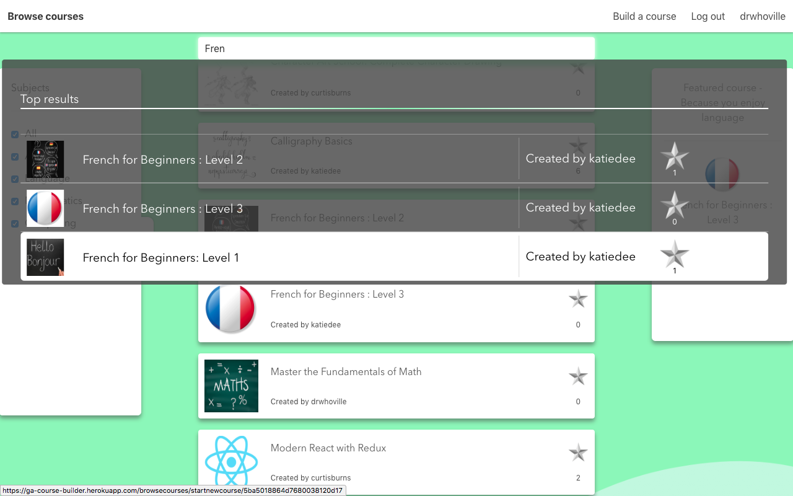

# wdi-project-four
Final project - General Assembly - Course-provider/builder

  

[Visit the Course builder app on Heroku](https://ga-course-builder.herokuapp.com)

[View the Course builder app on GitHub](https://github.com/curtisburns/wdi-project-four)
## Brief
Technical Requirements

* Build a full-stack application by making your own backend and your own front-end
* Use an Express API to serve your data from a Mongo database
* Consume your API with a separate front-end built with React
* Be a complete product which most likely means multiple relationships and CRUD functionality for at least a couple of models
* Implement thoughtful user stories/wireframes that are significant enough to help you know which features are core MVP and which you can cut
* Have a visually impressive design to kick your portfolio up a notch and have something to wow future clients & employers. ALLOW time for this.
* Be deployed online so it's publicly accessible.
* Have automated tests for at least one RESTful resource on the back-end, and at least one classical and one functional component on the front-end.
* Improve your employability by demonstrating a good understanding of testing principals.
___

# Technologies used:

* HTML
* SCSS
* Bulma
* JavaScript
* Node.js
* React.js
* React-reveal.js
* MongoDB
* GitHub
* Git

___

# Wireframes

## Register/Login

  

  

## Course Index

  

## Course creation tutorial

  

## Course creation - Overview

  

## Styling

In project three, I had learned that having a design to go by really helped with planning the structure of the site and decided to do this for project four. It was also a good opportunity to improve my skills on sketch.\

The style I went for was a simple, clean yet slightly colourful/playful theme as I felt this would work well for an app that I intended to be used by all ages. I wanted to consider the UX a little more than I had done in previous projects, and to do that I needed to ensure I had more time to focus on styling with CSS and planning ahead with the designs certainly helped.

## Concept

The idea behind this project was that a user could not only take courses for free, but also build courses for others to take. I liked the thought that if someone was willing to teach something free of charge, they would have to do it out of passion for the subject, and therefore the quality of the content and teaching would be reflective of that passion, and more beneficial to the student. The aim of the app is to provide users with the tools to achieve this.

## Final Product

## Login

  

## Login - Welcome

  

## Course Index

  

## Course Index - Filter

  

## Course creation - Intro

  

## Course creation - Form

  

## Course creation - Course Overview

  

## Course creation - Templates

  

  

  

  

## Course Show

  

  

  

## Page Show

  

  

  

  

## Course Finish

  

  

  

## User Profile

  

___

# Approach taken

Having placed more focus on planning this project, I aimed to break each part into it's own component as is intended with React.js, which I enjoyed doing. When it came to transitioning between creation mode and study mode, I wanted to make components that could be used in both scenarios. This can be seen in the 'Page Show' and template components, where the show component will change it's behaviour based on how information is passed to it (different keys on the state). I also had a chance to experiment with dynamic rendering, so that any page could be rendered based on the template number assigned to it, despite them being different components.\

I had decided the MVP to be the ability to create a simple course, and take the course. Th option to rate, filter, suggest courses based on user preferences and any other additional function were a bonus. While I felt I had achieved this, I wish I could have managed my time better to allow myself to add even more functionality. Much time was lost due to the styling, I was far from DRY doing this and if I did it again, I would be smarter with my classes and SCSS variables.

___
# Wins

A big win for me was getting the pages to load dynamically based on the templates used to create them. This had implications for scalability as I could add more templates in future and rely on the fact that the 'Page Show' component would handle this if I imported the new template into it.

Another win would be the overall result of my work by deadline day. I was mostly satisfied with what I had achieved in a week, and was excited about the prospect that as is, I could construct and have people take simple courses. I was also pleased about the ease at which this could be done, which was my intention for the project. Overall I had a lot of fun doing this, and learnt a great deal about using React.js and myself as a coder.

___
# Blockers

My main blocker was the styling. As I tend to try and write code that is concise and efficient, when it came to the styling I felt I could have refactored a lot. Overall I was very pleased with the look and feel of the site, but I know that if I had to make any changes to it, I had have to scour through a large number of classes across multiple SCSS files to change the same thing. Had I used a bit more foresight as to which styles would be common throughout the site, I could have been a bit smarter when applying classes to elements.

___
# Future features

Here is a list of where I would take this project in the future:

* Fix bugs! 
  * When giving a star but no feedback, an empty comment is created on the show page and deleting this causes an error.
  * If you have not completed any courses, the suggestions that are based on your favourite subject a 'null'.
  * And a few others...
* Finish template 5 and add a number of others.
* Finish adding functionality to resume a course where students left off.
* Refactor - I would like to look into how other larger projects are modularised so that maintainance and debugging are more manageable. This would also make things easier for scalability. I think this is one of the more valuable things to learn about as I look into making more complex projects, I feel this approach to structuring code in this way lends itself well to the capabilities of React.js.
* Add statistics for course creators:
  ** Number of people currently enrolled (never got round to fully implementing this).
  ** Heat map to show which countries students who have taken the course reside in.
  ** Useful ratios such as completed to total enrolled.
  ** Which pages are skipped, time to complete etc.
* Chat rooms or forums for people taking a course so that teachers and students can discuss ideas and approaches to problems.
* Create a private spaces for students and teachers belonging to schools so that homework and private assignments/courses can be shared.
* Admins and report function to be able to manage content.
* Many more - a project is never finished!
  
  
  
